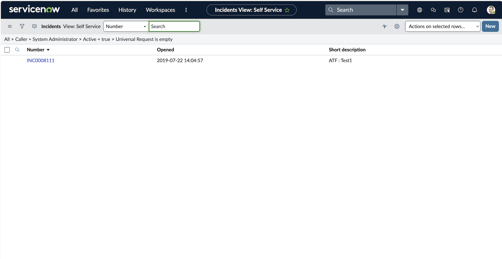

# SOC Incident Lifecycle in ServiceNow ITSM (SSH Brute Force, MITRE T1110)

## Incident Summary

A confirmed SSH brute-force compromise, originally detected in a Wazuh SIEM lab, was logged and worked through a complete ITSM incident lifecycle in a live ServiceNow Personal Developer Instance. The incident was created, triaged, prioritized, assigned, worked with documented response actions, resolved, and permanently closed, with automatic SLA tracking throughout. This project demonstrates the operational side of SOC work: what happens to a detection after it fires.

## Executive Summary

On 08 July 2026, the SSH brute-force compromise of host ubuntu-agent (detected by Wazuh, rules 5760, 5503, 5763, 40112, mapped to MITRE T1110) was logged as incident INC0010002 in ServiceNow. The incident was rated Priority 2 (High) from Impact Medium and Urgency High, routed to the Network assignment group, and driven through the New, In Progress, Resolved, and Closed states. Each stage was documented with analyst work notes forming an auditable response timeline. ServiceNow automatically attached three SLA timers on submission; the one-hour response SLA breached during the exercise, which is documented honestly below as a realistic operational outcome.

## Affected System

| Attribute | Value |
| --- | --- |
| ITSM platform | ServiceNow Personal Developer Instance (dev207002) |
| Incident number | INC0010002 |
| Caller | James Smith |
| Opened by | System Administrator (SOC analyst) |
| Category | Network |
| Priority | 2 - High (Impact 2 Medium, Urgency 1 High) |
| Assignment group | Network |
| Source detection | Wazuh SIEM, host ubuntu-agent, MITRE T1110 |
| Attacker source IP | 192.168.64.15 |
| Compromised account | james |
| Date | 08 July 2026 |

## Investigation Methodology

### 1. Baseline

Before creating any records, the instance's out-of-box state was captured. The Incident table shipped with 67 demo incidents, all generic IT issues (email outages, file share access, SAP availability). None were security incidents, giving a clean reference point against which the SOC ticket would stand out.



**SOC Observations**

The default data set contains only routine IT service disruptions. Establishing this baseline confirms that the security incident created next is the analyst's own work and is clearly distinguishable from platform demo data.

### 2. Incident creation and prioritization

A new incident was created from the real Wazuh detection. The short description named the host, the outcome, and the ATT&CK technique. Severity was set through the Impact and Urgency inputs, and ServiceNow auto-calculated Priority.


**SOC Observations**

Impact was set to Medium (single host affected) and Urgency to High (a confirmed compromise means an attacker is already inside, so response is time-critical). The Impact-by-Urgency matrix resolved this to Priority 2 High. Setting Urgency to High rather than Medium reflects the difference between a failed brute-force attempt and an actual breach, and is the key severity judgment in this incident.

### 3. Automatic SLA tracking

On submission, ServiceNow attached three SLA and OLA timers to the incident based on its priority, and started the clocks immediately.


**SOC Observations**

The priority selection drove three commitments without any manual configuration: a Priority 2 response SLA (1 hour), a Priority 2 resolution SLA (8 hours), and a Network group resolution OLA. This mirrors real SOC operations, where incidents are bound by response and resolution deadlines that analysts must race against.

### 4. Response documentation

The incident was moved to In Progress and worked with two analyst work notes: a triage note establishing the facts, and a containment note recording the response actions. These stacked chronologically in the Activity log.


**SOC Observations**

The triage note recorded the detection source, the specific Wazuh rules that fired, the compromised account, the attacker IP, and the ATT&CK mapping. The containment note documented the response: blocking the source IP, disabling and resetting the compromised account, terminating attacker sessions, hunting for post-compromise activity (none found beyond the initial login), and recommending preventive hardening. The Activity log now reads as a complete, timestamped response timeline.

### 5. Resolution and SLA outcome

The incident was resolved with a resolution code and resolution notes, then permanently closed. Resolving the incident paused the resolution clocks, but the one-hour response SLA had already breached.


**SOC Observations**

At resolution the resolution SLAs were paused (13.53% and 27.06% elapsed), but the Priority 2 response SLA shows 108.36% elapsed, marked breached in red. This breach occurred because of the time taken between steps during this training exercise, not a genuine operational delay. In a live SOC this would trigger an SLA breach notification and an escalation review. It is documented here honestly rather than hidden, since recognizing and explaining a breach is itself part of the analyst skill set.

### 6. Closure

The incident was moved to Closed, completing the lifecycle. The system confirmed the record as permanently closed.


**SOC Observations**

The incident traveled the full path New to In Progress to Resolved to Closed, with documentation at each transition. The closed record is the permanent artifact of the response.

## Indicators of Compromise

| Type | Indicator |
| --- | --- |
| Source IP | 192.168.64.15 |
| Compromised account | james |
| Service | SSH, TCP 22 |
| Source detection | Wazuh rules 5760, 5503, 5763, 40112 |
| ITSM record | INC0010002 |

## MITRE ATT&CK

| Tactic | Technique | ID |
| --- | --- | --- |
| Credential Access | Brute Force | T1110 |
| Credential Access | Password Guessing | T1110.001 |
| Defense Evasion, Persistence, Privilege Escalation, Initial Access | Valid Accounts | T1078 |

## SOC Analyst Findings

The detection from the Wazuh lab was successfully operationalized as a managed incident. The severity was set with defensible reasoning, the ticket was routed to an appropriate group, and the response was documented in a way that would let any analyst pick up the incident and understand its full history. The lifecycle completed cleanly, and the one SLA breach was identified and explained rather than obscured.

## SOC Analyst Response

The incident record captures the response taken against the compromise: source IP blocked, compromised credential disabled and reset, attacker sessions terminated, post-incident hunt completed with no further compromise found, and preventive hardening (key-based authentication, rate-limiting) recommended. The resolution and close notes formally documented the outcome and root cause (a weak password on the james account).

## Analyst Insight

Detection is only half of security operations. A fired alert has no value until it is triaged, prioritized, worked, and closed with a clear record of what was done and why. Working this incident in ServiceNow made the operational reality concrete: severity is a deliberate judgment with downstream consequences (it drove the SLA commitments automatically), documentation is the medium through which a response is coordinated and audited, and SLAs are unforgiving clocks. Seeing the response SLA breach in real time was the sharpest lesson, it showed exactly how time pressure is built into the tooling a SOC runs on.

## Learning Outcome

- Provisioned and operated a live ServiceNow ITSM instance from scratch
- Translated a real SIEM detection into a properly categorized, prioritized incident
- Applied the Impact-by-Urgency matrix to set a defensible priority for a confirmed compromise
- Documented a full response timeline using analyst work notes
- Observed automatic SLA and OLA tracking and interpreted a real SLA breach
- Drove an incident through the complete New to Closed lifecycle

## Repository Structure

```
02-servicenow-itsm/
├── README.md
└── screenshots/
    ├── 01_baseline_incident_list.png
    ├── 02_incident_created_in_queue.png
    ├── 03_sla_timers_inprogress.png
    ├── 04_activity_worknotes_timeline.png
    ├── 05_sla_breach_resolved.png
    └── 06_incident_closed_final.png
```

## Conclusion

This project completed the operational counterpart to the Wazuh detection lab: a real security detection was managed end to end as a ServiceNow incident, from creation through prioritization, response documentation, resolution, and permanent closure, with automatic SLA tracking and an honestly documented breach. Together with the detection project, it shows both halves of SOC work, seeing the attack and running the response.
